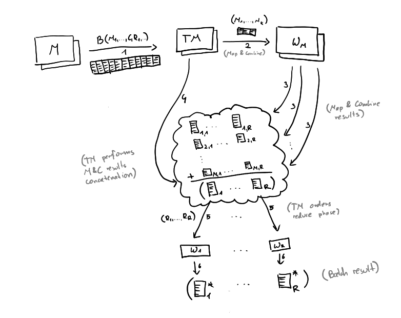

# edi-mapreduce

Kubernetes-based distributed MapReduce system.

## Assumptions

Not following these assumptions leads to disaster, make sure your binaries
strictly follow these. 

We assume that the client provides the following **statically linked** binaries:

### Map
```
./map -i <input_file_path> -o <output_file_path>
```
Behaviour: forms a list of pairs (key, some value) based on the input file
contents and saves it to the output file specified by path

You can assume that the output_file_path is not accessed by anyone else.

### Partitioner
```
./partition -R <R-param> -i <input_file_path> -o <output_directory>
```

Behaviour: deterministically partitions the input file into R partitions.
**Appends** (!) resulting partitions to already existing files in the output
directory.

You can assume that files in the output directory are not accessed concurrently.

### Reduce
```
./reduce -i <input_file_path> -o <output_file_path>
```
Behaviour: reduces all (k, value) pairs for k = key into one (key, new_value)
where new_value is an aggregate of all values from pairs.

Input files do not need to be sorted. There is a guarantee that 
all values for a given key are in the input file.

You can assume that the output_file_path is not accessed by anyone else.

## Build

### gRPC

To generate Java stubs based on `src/main/proto` files, invoke

```
./gradlew generateProto
```

Service stubs (`ImplBase` classes) will be located
under `/build/generated/main/grpc/`

### Pushing Docker images to Artifact Registry

Gradle target `dockerPushImages` builds docker images of all modules and pushes them to the
specified artifact registry.

Pushing to AR requires proper authentication:
https://cloud.google.com/artifact-registry/docs/docker/authentication
